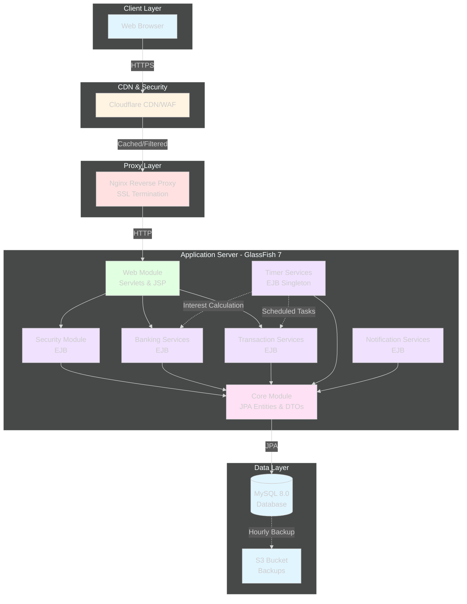
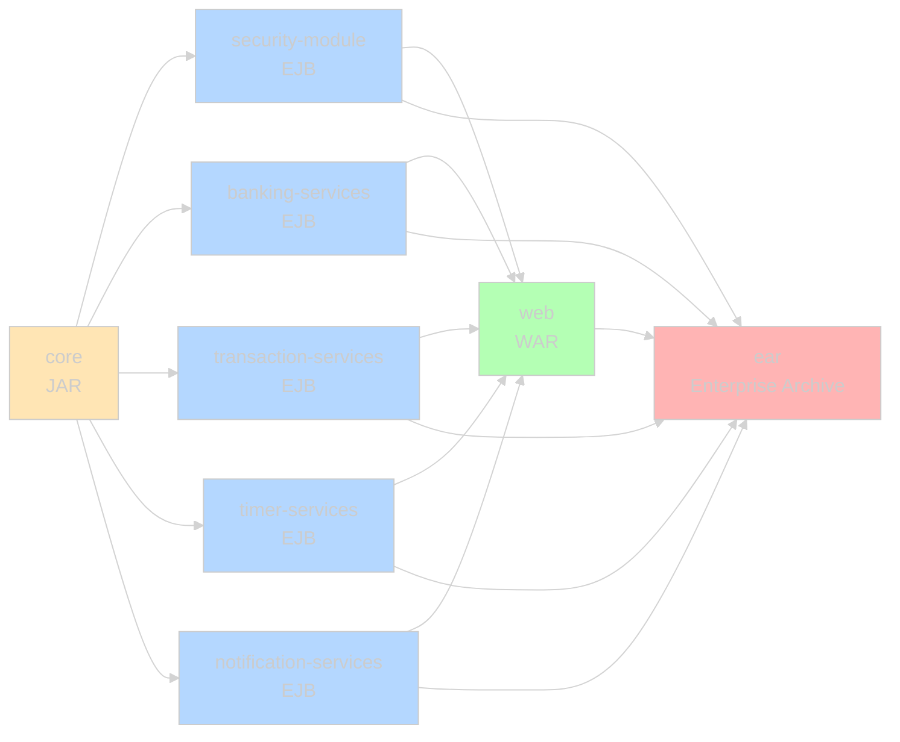
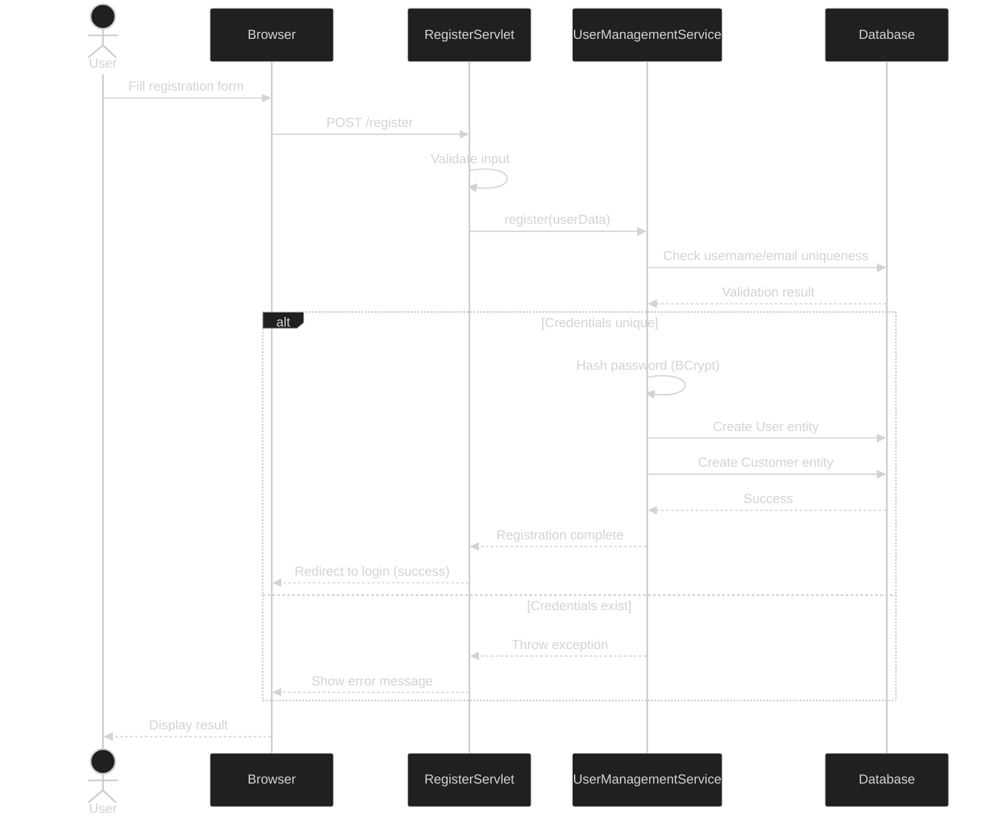
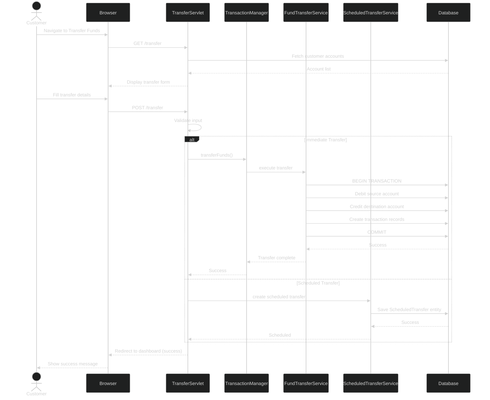
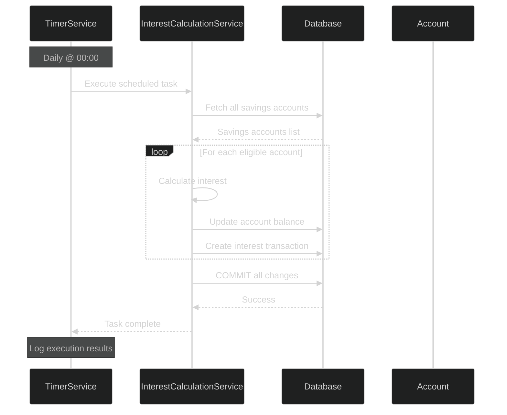
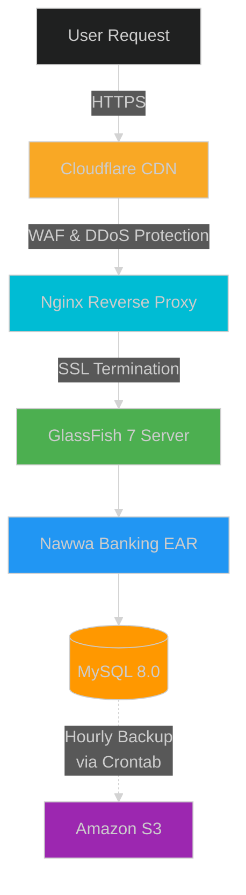
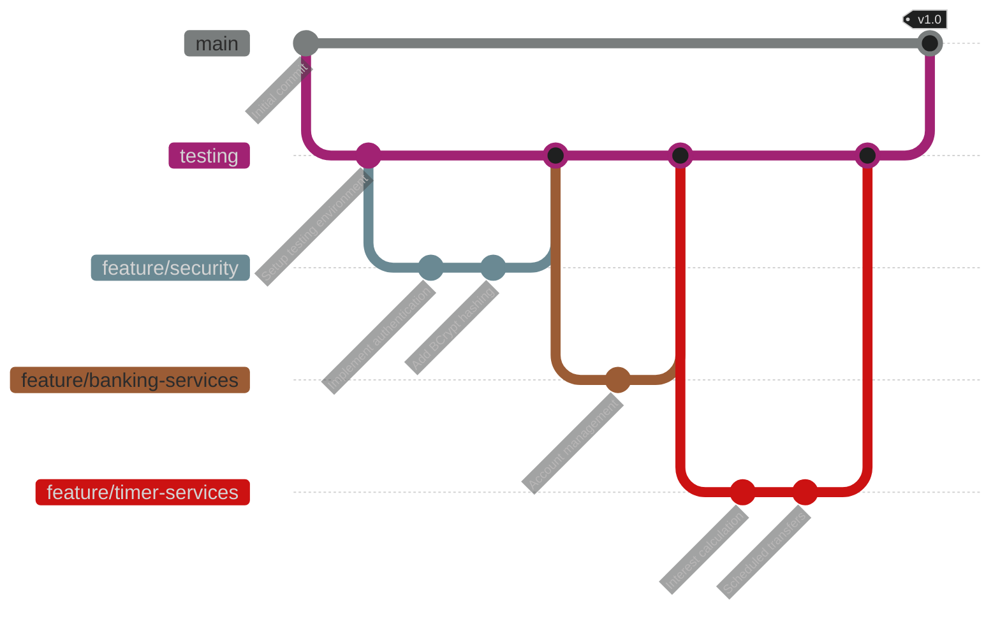
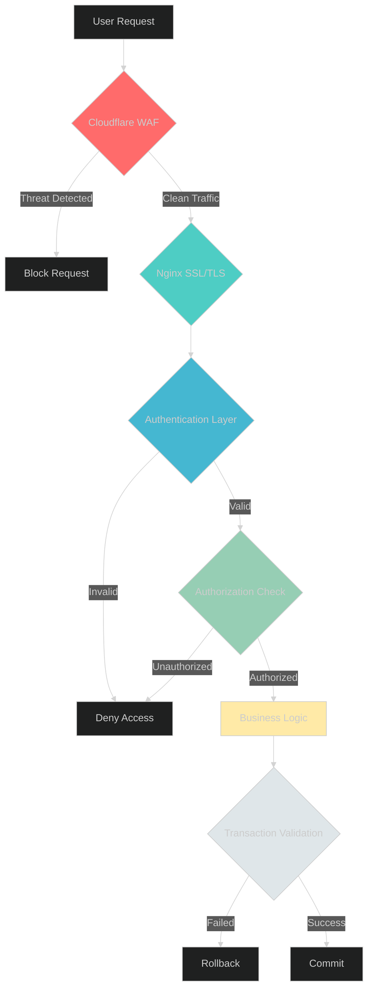

<div align="center">

# 🏦 Nawwa Banking System

### Enterprise-Grade Banking Platform Built with Jakarta EE 10 & EJB

[](https://www.oracle.com/java/)
[](https://jakarta.ee/)
[](https://glassfish.org/)
[](https://www.mysql.com/)
[](LICENSE)

[](https://github.com/isharax9/nawwa-banking-system/stargazers)
[](https://github.com/isharax9/nawwa-banking-system/network/members)
[](https://github.com/isharax9/nawwa-banking-system/issues)

**[📖 Documentation](https://doc.bank.nawwa.xyz)** • **[🚀 Live Demo](https://bank.nawwa.xyz)** • **[🐛 Report Bug](https://github.com/isharax9/nawwa-banking-system/issues)** • **[✨ Request Feature](https://github.com/isharax9/nawwa-banking-system/issues)**

</div>

---

## 📑 Table of Contents

- [Overview](#-overview)
- [Key Features](#-key-features)
- [System Architecture](#-system-architecture)
- [Technology Stack](#-technology-stack)
- [Getting Started](#-getting-started)
- [Module Structure](#-module-structure)
- [Application Workflows](#-application-workflows)
- [Screenshots](#-screenshots)
- [Deployment](#-deployment)
- [Analytics & Monitoring](#-analytics--monitoring)
- [Security](#-security)
- [License](#-license)
- [Support & Community](#-support--community)

---

## 🎯 Overview

The **Nawwa Banking System** is a modern, enterprise-grade core banking platform designed to revolutionize banking operations. Built on the robust **Jakarta EE 10** platform with **Enterprise JavaBeans (EJB)**, this system delivers unparalleled security, scalability, and reliability for mission-critical banking functions.

### 🎓 Core Objectives

✅ **Secure & Efficient** - Manage core banking functions with enterprise-level security  
✅ **Transactional Integrity** - Leverage EJB for ACID-compliant transactions  
✅ **Automated Operations** - Utilize EJB Timer Services for scheduled tasks  
✅ **Scalable Architecture** - Multi-module design for independent development and deployment

---

## ✨ Key Features

<div align="center">

| Feature | Description |
|---------|-------------|
| 🔐 **Secure Authentication** | BCrypt password hashing with robust user management |
| 👥 **Customer Management** | Complete lifecycle management of customer profiles and accounts |
| 💰 **Transaction Processing** | Real-time and scheduled fund transfers with ACID compliance |
| ⏰ **Automated Services** | EJB Timer Services for interest calculation and scheduled operations |
| 📊 **Analytics Integration** | Google Analytics & Microsoft Clarity for user behavior insights |
| 📄 **PDF Reports** | Downloadable transaction statements and reports |
| 🛡️ **Multi-layer Security** | WAF, DDoS protection, and programmatic authorization |
| 📱 **Responsive UI** | Modern interface with Bootstrap 5 and dynamic components |

</div>

---

## 🏗️ System Architecture

The Nawwa Banking System employs a multi-module architecture that ensures separation of concerns and enables parallel development.



### 📦 Module Structure

| Module | Type | Description |
|--------|------|-------------|
| **core** | JAR | Foundational module with JPA entities, DTOs, mappers, and exceptions |
| **security-module** | EJB | Authentication, authorization, and user management |
| **banking-services** | EJB | Customer and account CRUD operations |
| **transaction-services** | EJB | Financial transaction processing with Facade pattern |
| **timer-services** | EJB | Automated background tasks (interest, scheduled transfers) |
| **notification-services** | EJB | Notification and alert management |
| **web** | WAR | Presentation layer with Servlets and JSP |
| **ear** | EAR | Final deployable Enterprise Archive |



---

## 💻 Technology Stack

<div align="center">

### Backend Technologies


### Frontend Technologies


### Infrastructure


</div>

| Category | Technology | Purpose |
|----------|-----------|----------|
| **Backend Framework** | Jakarta EE 10 | Enterprise platform foundation |
| **Business Logic** | EJB 4.0 (`@Stateless`, `@Singleton`) | Transaction management & business components |
| **Persistence** | JPA 3.1 with Hibernate | Object-Relational Mapping |
| **Database** | MySQL 8.0 | Relational data storage |
| **Frontend** | Servlets 6.0 & JSP 3.1 with JSTL | Server-side rendering |
| **UI Framework** | Bootstrap 5, jQuery, DataTables, Chart.js | Responsive UI & data visualization |
| **Security** | jBCrypt | Adaptive password hashing |
| **Build Tool** | Apache Maven 3.9+ | Dependency & build management |
| **App Server** | GlassFish 7 | Jakarta EE 10 runtime |
| **Proxy** | Nginx | Reverse proxy & SSL termination |
| **CDN/Security** | Cloudflare | WAF, DDoS protection & caching |

---

## 🚀 Getting Started

### Prerequisites

Before you begin, ensure you have the following installed:

- ☕ **Java Development Kit (JDK) 17** or higher
- 🔧 **Apache Maven 3.9+**
- 🗄️ **MySQL 8.0+**
- 🐠 **GlassFish 7.0** Application Server

### Installation & Setup

1. **Clone the Repository**
   ```bash
   git clone https://github.com/isharax9/nawwa-banking-system.git
   cd nawwa-banking-system
   ```

2. **Configure MySQL Database**
   ```sql
   CREATE DATABASE nawwa_banking;
   CREATE USER 'banking_user'@'localhost' IDENTIFIED BY 'your_password';
   GRANT ALL PRIVILEGES ON nawwa_banking.* TO 'banking_user'@'localhost';
   FLUSH PRIVILEGES;
   ```

3. **Update Database Configuration**
   
   Configure your database connection in the persistence configuration file.

4. **Build the Project**
   ```bash
   mvn clean install
   ```

5. **Deploy to GlassFish**
   
   Deploy the generated EAR file from `ear/target/` to your GlassFish server.

6. **Access the Application**
   
   Navigate to: `http://localhost:8080/nawwa-banking/`

### 👤 Default Admin Credentials

For testing administrative features:

- **Username:** `mac`
- **Password:** `password123A!`

> ⚠️ **Important:** Change default credentials immediately in production!

---

## 📋 Module Structure

### Core Module (JAR)
The foundational library containing:
- 🏗️ JPA Entities (User, Customer, Account, Transaction)
- 📦 Data Transfer Objects (DTOs)
- 🔄 Mappers for entity-DTO conversion
- ⚠️ Custom exception hierarchy

### Security Module (EJB)
- 🔐 User authentication and registration
- 🔑 Password management with BCrypt
- ✅ Authorization and role management
- 👥 User lifecycle operations

### Banking Services (EJB)
- 👤 Customer profile management
- 🏦 Account CRUD operations
- 📊 Account activation/deactivation
- 🔄 Account type management

### Transaction Services (EJB)
- 💸 Fund transfers (atomic operations)
- 💰 Payments and deposits
- 📄 Transaction history
- 📥 PDF statement generation

### Timer Services (EJB)
Automated background operations:
- 📈 **Interest Calculation** - Daily interest for savings accounts
- ⏰ **Scheduled Transfers** - Execute scheduled fund movements
- 📊 **Daily Reports** - Generate system summary reports
- 🧹 **Maintenance Tasks** - Weekly data archival and cleanup

### Web Module (WAR)
- 🌐 Servlet-based controllers
- 🎨 JSP views with JSTL
- 📱 Responsive Bootstrap UI
- 📊 Interactive dashboards with Chart.js

---

## 🔄 Application Workflows

### User Registration Flow



### Fund Transfer Flow



### Automated Interest Calculation Flow



---

## 🎨 Screenshots

### Login Page
Clean and secure authentication interface


### Customer Dashboard
Comprehensive overview of accounts and recent transactions


### Fund Transfer Interface
Support for both immediate and scheduled transfers


### Transaction History
Detailed transaction logs with color-coded amounts


### User Management (Admin)
Administrative interface for user management


### Deposit/Withdrawal Interface
Simple and secure fund operations


### Customer Management (Admin)
Manage customer profiles and information


### Bank Account Management (Admin)
Administrative control over all bank accounts


### PDF Transaction Reports
Downloadable transaction statements


### EJB Timer Services in Action
Server logs showing automated timer execution


---

## 🚀 Deployment

### Deployment Architecture

The application is deployed in a production-grade environment optimized for security, performance, and scalability.



### Infrastructure Components

| Component | Technology | Purpose |
|-----------|-----------|----------|
| 🌐 **Application Server** | GlassFish 7 on Ubuntu VPS | Jakarta EE 10 runtime environment |
| 🔒 **Reverse Proxy** | Nginx | SSL/TLS termination, load balancing |
| 🛡️ **CDN & Security** | Cloudflare | WAF, DDoS protection, edge caching |
| 💾 **Database Backup** | Crontab + AWS S3 | Hourly automated backups |
| 📊 **Monitoring** | GlassFish Admin Console | Server health & performance |

### Version Control Strategy



**Branching Strategy:**
- `main` - Production-ready releases
- `testing` - Integration and QA testing
- `feature/*` - Individual feature development

### 📚 Documentation Portal

Comprehensive documentation available at: **[doc.bank.nawwa.xyz](https://doc.bank.nawwa.xyz)**

<table>
<tr>
<td width="50%">

**Light Mode**


</td>
<td width="50%">

**Dark Mode**


</td>
</tr>
</table>

---

## 📊 Analytics & Monitoring

### Google Analytics Integration

The system leverages Google Analytics for comprehensive usage insights:

- 📈 **User Engagement** - Session duration, bounce rates, page views
- 🎯 **Conversion Tracking** - Account creation, transaction completion rates
- 🌍 **Traffic Analysis** - User acquisition sources and demographics
- 📱 **Device Analytics** - Cross-platform usage patterns


### Microsoft Clarity Integration

Qualitative user behavior analysis through:

- 🎥 **Session Recordings** - Anonymized user interaction playback
- 🔥 **Heatmaps** - Click, scroll, and attention pattern visualization
- 😤 **Frustration Detection** - Rage clicks and abandoned processes
- 🎯 **Dead Click Analysis** - Non-interactive element identification

<table>
<tr>
<td width="50%">

**Dashboard Overview**


</td>
<td width="50%">

**Session Recordings**


</td>
</tr>
<tr>
<td width="50%">

**Click Heatmaps**


</td>
<td width="50%">

**Scroll Heatmaps**


</td>
</tr>
</table>

### Additional Analytics Views


---

## 🔒 Security

### Multi-Layer Security Architecture



### Security Features

| Layer | Implementation | Description |
|-------|---------------|-------------|
| 🌐 **Network** | Cloudflare WAF | DDoS protection, malicious traffic filtering |
| 🔐 **Transport** | Nginx SSL/TLS | End-to-end encryption with HTTPS |
| 🔑 **Authentication** | BCrypt Hashing | Adaptive password hashing (2^10 rounds) |
| ✅ **Authorization** | Programmatic | Role-based access control (RBAC) |
| 💼 **Transaction** | Container-Managed | ACID compliance via EJB CMT |
| ⚠️ **Exception Handling** | Custom Hierarchy | Automatic transaction rollback on errors |
| 🔍 **Input Validation** | Server-side | Comprehensive form validation |
| 📝 **Audit Logging** | EJB Interceptors | Operation tracking and monitoring |

### Exception Handling Examples

**Inactive Account Transaction Attempt**


**Unauthorized Access Attempt**


### Input Validation Examples

**Registration Validation Flow**

<table>
<tr>
<td width="33%">


</td>
<td width="33%">


</td>
<td width="33%">


</td>
</tr>
</table>

### GlassFish Module Management

**Server Module Deployment**


---

## 🔧 Development Workflow

### Feature Development Process

**Example: Adding PDF Report Feature**

<table>
<tr>
<td width="50%">

**Step 1: Create Pull Request**


</td>
<td width="50%">

**Step 2: Merge to Main**


</td>
</tr>
</table>

**Final Repository State**


---

## 🏆 Key Achievements

<div align="center">

✅ **Robust & Reliable** - Container-managed transactions and persistent EJB timers  
✅ **Enterprise Security** - Multi-layer security with BCrypt and programmatic authorization  
✅ **Process Automation** - Scheduled tasks reduce manual intervention by 80%  
✅ **High Availability** - Hourly database backups with S3 redundancy  
✅ **Scalable Architecture** - Multi-module design enables independent scaling  
✅ **Data-Driven Insights** - Integrated analytics for continuous improvement

</div>

---

## 📄 License

This project is licensed under the **MIT License**.

```
Copyright (c) 2025 Ishara Lakshitha

Permission is hereby granted, free of charge, to any person obtaining a copy
of this software and associated documentation files (the "Software"), to deal
in the Software without restriction, including without limitation the rights
to use, copy, modify, merge, publish, distribute, sublicense, and/or sell
copies of the Software, and to permit persons to whom the Software is
furnished to do so, subject to the following conditions:

The above copyright notice and this permission notice shall be included in all
copies or substantial portions of the Software.

THE SOFTWARE IS PROVIDED "AS IS", WITHOUT WARRANTY OF ANY KIND, EXPRESS OR
IMPLIED, INCLUDING BUT NOT LIMITED TO THE WARRANTIES OF MERCHANTABILITY,
FITNESS FOR A PARTICULAR PURPOSE AND NONINFRINGEMENT. IN NO EVENT SHALL THE
AUTHORS OR COPYRIGHT HOLDERS BE LIABLE FOR ANY CLAIM, DAMAGES OR OTHER
LIABILITY, WHETHER IN AN ACTION OF CONTRACT, TORT OR OTHERWISE, ARISING FROM,
OUT OF OR IN CONNECTION WITH THE SOFTWARE OR THE USE OR OTHER DEALINGS IN THE
SOFTWARE.
```

---

## 📞 Support & Community

<div align="center">

### 💬 **Get Help & Connect**

| Platform | Link | Purpose |
|----------|------|---------|
| 📧 **Email** | [isharax9@gmail.com](mailto:isharax9@gmail.com) | Direct support & inquiries |
| 💬 **Telegram** | [@mac_knight141](https://t.me/mac_knight141) | Quick questions & community |
| 💼 **LinkedIn** | [isharax9](https://www.linkedin.com/in/isharax9/) | Professional networking |
| 📸 **Instagram** | [@mac_knight141](https://www.instagram.com/mac_knight141/) | Updates & behind-the-scenes |
| 🐦 **Twitter** | [@isharax9](https://twitter.com/isharax9) | Announcements & tech discussions |

### 🐛 **Issues & Contributions**

| Type | Link | Description |
|------|------|-------------|
| 🐛 **Bug Reports** | [GitHub Issues](https://github.com/isharax9/nawwa-banking-system/issues) | Report bugs and request features |
| 💬 **Discussions** | [GitHub Discussions](https://github.com/isharax9/nawwa-banking-system/discussions) | Community Q&A and ideas |
| 📖 **Documentation** | [Project Docs](https://doc.bank.nawwa.xyz) | Complete guides and references |

### 🌟 **Show Your Support**

</div>

<div align="center">

**⭐ Star this repository if it helped you!**

[](https://github.com/isharax9/nawwa-banking-system/stargazers)
[](https://github.com/isharax9/nawwa-banking-system/network/members)
[](https://github.com/isharax9/nawwa-banking-system/watchers)
[](https://github.com/isharax9/nawwa-banking-system/issues)

---

### 🚀 **Ready to Transform Banking Management?**

<div align="center" style="margin: 20px 0;">

**[⬇️ Download Now](https://github.com/isharax9/nawwa-banking-system/archive/refs/heads/main.zip)** • **[📖 Read Docs](https://doc.bank.nawwa.xyz)** • **[🤝 Contribute](https://github.com/isharax9/nawwa-banking-system/blob/main/CONTRIBUTING.md)**

</div>

**Made with ❤️ by [Ishara Lakshitha](https://github.com/isharax9) • © 2025**

*Empowering Banking Through Technology*

</div>
